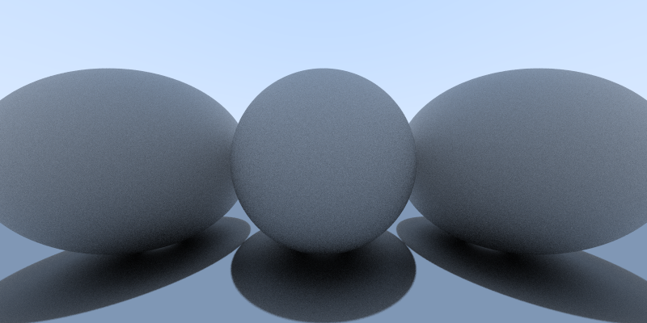

# RayTracer

[Peter Shirley's "Ray Tracing in a Weekend"](https://github.com/RayTracing/raytracinginoneweekend) implemented in [Clojure](https://clojure.org/). 

## Current output

This 800x400 image takes 40s on my ancient laptop and less than 20 on my PC.
Currently completed up to about chapter 5

## License

Copyright © 2019 Ali Raheem

This program and the accompanying materials are made available under the
terms of the Eclipse Public License 2.0 which is available at
http://www.eclipse.org/legal/epl-2.0.

This Source Code may also be made available under the following Secondary
Licenses when the conditions for such availability set forth in the Eclipse
Public License, v. 2.0 are satisfied: GNU General Public License as published by
the Free Software Foundation, either version 2 of the License, or (at your
option) any later version, with the GNU Classpath Exception which is available
at https://www.gnu.org/software/classpath/license.html.
